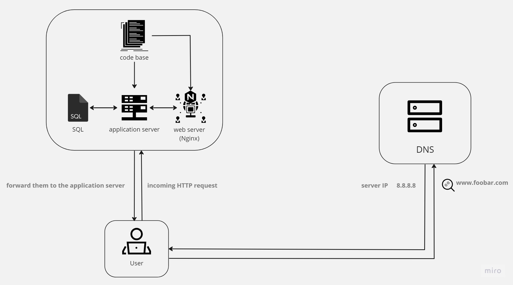

<strong>A simple server web infrastructure</strong>

the whiteboard represent a design of a one server web infrastructure that hosts the website that is reachable via www.foobar.com.

<strong>web infrastructure specifics</strong>

- <strong>Server definition.</strong>
a server is a computer of a software that serves a user using a network, like serving a web page, applications...

- <strong>The role of the domain name.</strong>
a domain name is the address that the user/client enters to a web browser, its role is being a human-readable address (exp www.foobar.com) which then the DNS translates it to an IP address (exp 8.8.8.8) so that the computer uses it to connect tà the web page.

- <strong>What type of DNS record www is in www.foobar.com?</strong>
the DNS record www in www.foobar.com is type A. by using SuperTool on mxtoolbox.com the www.foobar.com has a domain name of foobar.com and 173.231.209.34 as an IP Address. The "A" in A record stands for "address." An A record shows the IP address for a specific hostname or domain.

- <strong>the role of the web server</strong>
a web server, like the one used above (Nginx), handles HTTP requests from the users' browser by serving web pages to them.

- <strong>the role of the application server</strong>
an application server provides an environment for running and managing applications, typically web-based applications, and supports the execution of server-side code. 

- <strong>the role of the database</strong>
the database (exp MySQL) role is to store data like user information, content... used by the website that can be modified and accessed
- <strong>User/website communication</strong>

the server uses the HTTP/HTTPS protocol to commnicate with the user based on the TCP/IP (Transmission Control Protocol/Internet Protocol) protocol suite.

<strong>infrastructure's issues</strong>

1. SPOF(Single Point of Failure)
The infrastructure relies on a single server, which means it has a single point of failure. is something is down the entire website/application will become inaccessible.
 
2. Downtime when maintenance needed
any maintenance or updates that require restarting the web server will result in downtime for the website.

3. Cannot scale if too much incoming traffic
If the website experiences high traffic or if the traffic, the single server won't handle it well which will make it slow or crash.
