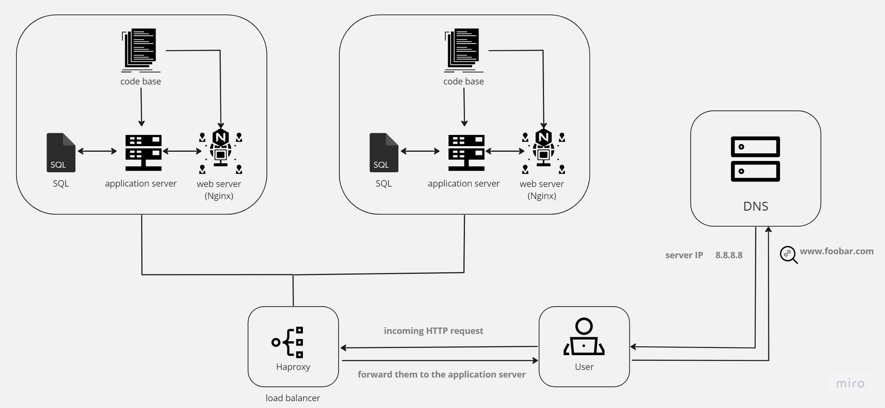

<strong>Distributed web infrastructure</strong>

the whiteboard above represents a three server web infrastructure that hosts the website www.foobar.com :
- 2 servers
- 1 web server (Nginx)
- 1 application server
- 1 load balancer (Haproxy)
- a codebase
- 1 database (MySQL)

<strong>Infrastructure specifics</strong>

- <strong>Added elements</strong>

the load-balancer (HAproxy) has been added to maintain a good performance by handelling traffic well.

- <strong>Distribution algorithm</strong>

for this infrastructure I used a Round Robin load balancing distributer.
Round Robin uses the Domain Name System (DNS) to distribute traffic between the servers in rotation.since Haproxy is used, it's best to use a static load balancing distributing algorithm; Each server in the rotation receives requests in turn, ensuring a balanced distribution of traffic.

- <strong>Active-Active or Active-Passive setup</strong>

the Haproxy enables an Active-Passive setup, where only one server actively handles incoming requests at a time.
an active-passive server remains on standby and takes over if the active server fails. Active-Active, on the other hand, would involve both servers actively handling requests at the same time.

- <strong>How a database Primary-Replica (Master-Slave) cluster works</strong>

The database cluster consists of a primary node and a replica node. The primary node handles read and write operations, while the replica node replicates data from the primary node to provide redundancy. The replica node can take over as the primary node in case of primary node failure, ensuring high availability and data durability.

- <strong>Difference between Primary and Replica Node</strong>

The primary node is responsible for processing read and write operations, making it the active database for the application. The replica node replicates data from the primary node and acts as a backup. However, it cannot handle write operations directly. The replica node helps provide data redundancy and can be promoted to the primary role if the primary node fails.

<strong>Issues with the infrastructure</strong>

1. <b>Single Point of Failure (SPOF):</b>

The infrastructure lacks redundancy in some areas, such as a single load balancer and a single database node. If any of these components fail, it can result in downtime or loss of service.

2. <b>Security Issues:</b>

The infrastructure lacks a firewall to protect against unauthorized access or malicious attacks.

3. <b>Monitoring:</b>

The infrastructure lacks monitoring capabilities.
