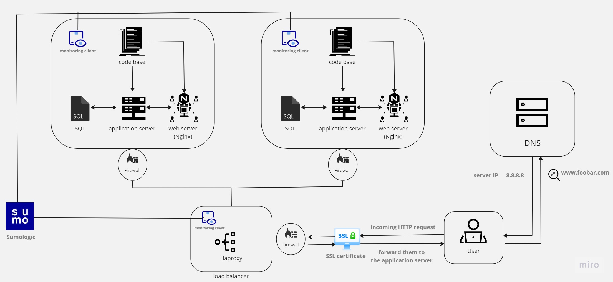

<strong>Secured and monitored web infrastructure</strong>

the whiteboard represents a three server web infrastructure that hosts the website www.foobar.com, it's secured, serves encrypted traffic, monitored.

<strong>Infrastructure specifics</strong>

- <strong>Added elements</strong>
the above infrastructure Three firewalls added to enhance security, An SSL certificate is included to enable HTTPS communication for the website www.foobar.com and Three monitoring clients to collect data and monitor the infrastructure.

- <strong>Firewalls role</strong>

The firewalls protect the servers from unauthorized access, malicious attacks, and keeps the network secured.

- <strong>HTTPS</strong>

HTTPS encrypts the data transmitted between the user's browser and the web server. this ensures integrity and secutiry from unauthorized access.

- <strong>Monitoring</strong>

monitoring is used for tracking the system's performance and security by collecting and analyzing data; this helps to take safety measures before anything bad happens.

- <strong>How the monitoring tool is collecting data</strong>

Sumo Logic collects data via agents or collectors installed on servers, APIs that directly fetch logs from cloud services, and remote collection methods like Syslog or HTTP/S. It gathers logs, metrics, and system information from various sources, sending this data to its platform for analysis and storage. Users can then query and analyze this data to monitor system health and performance.

- <strong>what to do if you want to monitor your web server QPS</strong>

You can do that by simply using Sumologic (or any monitoring tool) which offers the necessary visualization and alerting capabilities.

<strong>Issues with the infrastructure</strong>

1. <b>Terminating SSL at Haproxy Level:</b>

Terminating SSL at Haproxy Level will lead to no encryption of traffic between it and the web server.

2. <b>Having Only One MySQL Server Capable of Accepting Writes:</b>

It creates a single point of failure.

3. <b>Identical Components on Servers:</b>

Using the same components across all servers might lead to failures by increasing the risk of widespread failures or attacks.
