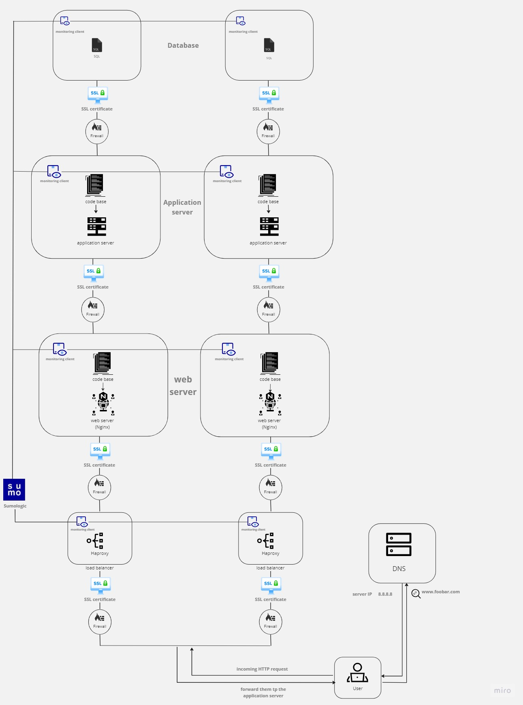

<strong>Up scaled web infrastructure</strong>

<strong>Infrastructure specifics</strong>

the above web infrastructure contains the following:

1. Server: A dedicated server that will host the infrastructure components and provide computing resources.

2. Load Balancer Cluster (HAproxy):

A cluster of load balancers is set up using HAproxy. The load balancers distributes incoming network traffic across multiple servers to ensure high availability, scalability, and efficient utilization of resources. Configuring HAproxy as a cluster with multiple instances allows for redundancy and fault tolerance. The load balancers will sit at the end of the infrastructure to distribute traffic to the appropriate components.

3. Component 1: Database

- This component is hosted on a separate server dedicated solely to running the database.
- The database server stores and manages the application's data.

4. Component 2: Application Server

- This component is hosted on a separate server.
- The application server runs the backend code of the application and handles the application's business logic.

5. Component 3: Web Server (Nginx)

- This component is hosted on a separate server.
- The codebase of the application, including static files like HTML, CSS, and JavaScript, are deployed on this server.

The load balancers (HAproxy) will sit at the end of the infrastructure, distributing incoming traffic to the appropriate components. Component 2 (Application Server) will handle the backend code and business logic, while Component 3 (Web Server) will handle serving static files and acting as a reverse proxy. Component 1 (Database) will handle data storage and management.

This infrastructure setup allows for scalable, fault-tolerant, and efficient handling of web traffic and application logic. Each component is separated and hosted on its own server, providing dedicated resources and allowing for independent scaling and optimization.

<strong>Issues with the infrastructure</strong>

1. Complexity and Maintenance:

The infrastructure's complexity may increase with the separation of components onto different servers. This can lead to increased maintenance efforts, configuration management challenges, and potential compatibility issues between the different components.

2. Cost:

Hosting each component on separate servers can result in increased infrastructure costs. Additionally, load balancers and other networking components can add to the overall cost.
